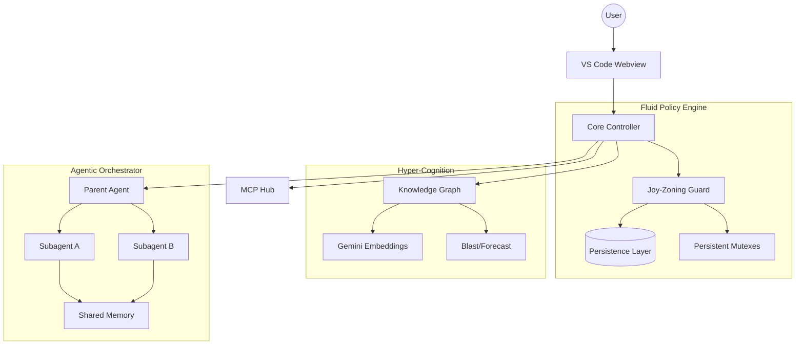

# CodeMarie: The Architectural Guardian

**CodeMarie** is an industrial-grade, model-agnostic agentic coding assistant designed to maintain architectural integrity in complex software ecosystems. Beyond simple code generation, CodeMarie acts as an **Architectural Guardian**, enforcing strict layering, managing distributed agentic workflows, and ensuring transactional stability across your workspace.

---

## 🏗️ Core Pillars of Intelligence

### 🧬 Joy-Zoning Framework
CodeMarie enforces a rigorous architectural pattern known as **Joy-Zoning**. It automatically categorizes every file into one of five distinct layers and enforces "Outside-In" dependency rules. The **Fluid Policy Engine** monitors every file operation to prevent layer leaks.

### 🧠 Hyper-Cognition & Long-Term Memory
CodeMarie moves beyond simple context windows via a persistent **Knowledge Graph** (BroccoliDB):
*   **Semantic Compaction**: Automatically landmarks high-value architectural decisions to survive context prunings.
*   **Recursive Blast Radius**: Dynamically calculates the multi-hop impact of a change using both historical churn and semantic dependencies (`MEM_BLAST`).
*   **Speculative Forecasting**: Predicts semantic conflicts between parallel task streams before merge (`MEM_FORECAST`).

### 🐝 Swarm Coordination & Safety
Industrial-grade orchestration for distributed workflows:
*   **Persistent Swarm Mutexes**: DB-backed locking (`swarm_locks`) that survives process restarts and ensures cross-agent synchronization.
*   **Hierarchical Orchestration**: Specialized sub-agents operate in a coordinated parent-stream model with a unified memory blackboard.
*   **Shared Memory Layers**: GlobalGuidelines and environmental constraints are synchronized across the entire swarm.

### 🛡️ Transactional Stability & Speculation
*   **Ghost Branches**: Create ephemeral, Git-backed playgrounds for speculative refactors without polluting task history.
*   **Atomic Workspaces**: Complete restoration of any previous state via a git-backed checkpointing system.
*   **DB Shadowing**: Every workspace modification is staged in a transactional buffer before being committed.

---

## 🛠️ Industrial Infrastructure

### 🔗 Advanced MCP Hub
Full integration with the **Model Context Protocol (MCP)**:
- **SSE & Stdio Transports**: Multi-protocol support for local and remote tool servers.
- **Native OAuth**: Integrated authentication for enterprise-grade tool integrations.
- **Dynamic Env Expansion**: Intelligent environment variable resolution for sensitive configurations.

### 📊 OpenTelemetry Observability
High-fidelity telemetry for audit trails and performance tuning:
- **TTFT & Latency Tracking**: Real-time monitoring of Time to First Token.
- **Token Economics**: Precise cost tracking per task, turn, and subagent.
- **Stability Metrics**: Monitoring "Architectural Entropy" and policy violation trends.

---

## 🚀 Model-Specific Optimization
CodeMarie provides custom-tuned **Prompt Variants** to extract maximum performance from frontier models:
- **Gemini 3.0 & GPT-5**: Native tool-calling optimizations and high-token window handling.
- **Trinity & Native Next-Gen**: Advanced reasoning prompts for complex system design.
- **Crossover/Search Models**: Specialized grounding for web-assisted research.

---

## 📐 System Architecture

---

## ⚡ Quick Start

1.  **Install**: Search for "CodeMarie" in the [VS Code Marketplace](https://marketplace.visualstudio.com/items?itemName=codemarie.codemarie).
2.  **Configure**: Add your API keys for [OpenRouter](https://openrouter.ai/), [Anthropic](https://www.anthropic.com/), [Google](https://ai.google.dev/), or [AWS Bedrock](https://aws.amazon.com/bedrock/).
3.  **Activate**: Click the CodeMarie icon in the sidebar and start your first "Architectural Intent" grounded task.

---

## 🤝 Contributing
Join us in building the world's most robust agentic assistant. Please read our [Contribution Guidelines](CONTRIBUTING.md) and [Security Policy](SECURITY.md).

---
## 🕰️ History & Origins
**CodeMarie** is a completely transformed, industrial-grade evolution of the original [Cline](https://github.com/cline/cline) repository. While it shares foundational DNA, the architecture, orchestration, and policy safeguarding have been reconstructed from the ground up to support enterprise-scale agentic coding.

---
*Built with ❤️ by the CodeMarie Team. Architectural Integrity is not an option; it's the core.*
