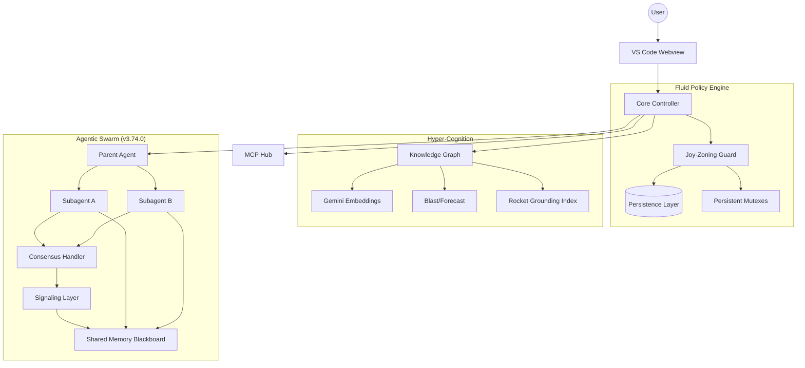
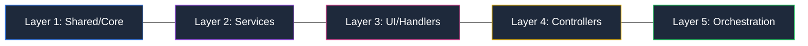

# CodeMarie: The Architectural Guardian

**CodeMarie** is an industrial-grade, model-agnostic agentic coding assistant designed to maintain architectural integrity in complex software ecosystems. Beyond simple code generation, CodeMarie acts as an **Architectural Guardian**, enforcing strict layering, managing distributed agentic workflows, and ensuring transactional stability across your workspace.

> [!IMPORTANT]
> **State-of-the-Art Production Hardening (v3.78.0)**: This release converts all mock MAS functionality into fully functional subsystems. The Swarm Consensus Engine now spawns true parallel Sub-Agent streams, and speculative merging leverages authentic LCA graph conflict resolution and dual-branch blast-radius intersection tracking.

---

## 🏗️ Core Pillars of Intelligence

### 🧬 Joy-Zoning Framework
CodeMarie enforces a rigorous architectural pattern known as **Joy-Zoning**. It automatically categorizes every file into one of five distinct layers and enforces "Outside-In" dependency rules. 

> [!TIP]
> Use the **Fluid Policy Engine** to monitor every file operation and prevent layer leaks in real-time.

### 🧠 Hyper-Cognition & Long-Term Memory
CodeMarie moves beyond simple context windows via a persistent **Knowledge Graph** (BroccoliDB) and the **Rocket Generation** grounding pipeline:
*   **Rocket Grounding**: 99% reduction in grounding latency via virtualized workspace indexing and heuristic fast-paths.
*   **Semantic Compaction**: Automatically landmarks high-value architectural decisions to survive context prunings.
*   **Knowledge Graph (KG) Resilience**: Self-healing graph nodes that automatically repair broken semantic links during repo churn.
*   **Speculative Pipeline**: Preview multi-hop impact of intent grounded changes (`MEM_BLAST`) before execution.

### 🐝 Multi-Agent System (MAS) & Unified Cognitive Fabric
CodeMarie v3.78.0 introduces the **Unified Cognitive Fabric** and complete **Production Hardening**, where sub-agents operate as a single, interconnected, and fully verified mind:
*   **Default Operational Mode**: MAS is now the default path, providing multi-agent orchestration for all complex grounded tasks (`masEnabled: true`).
*   **Shared Reasoning Canvas**: Sub-agents like `Ikigai`, `JoyZoning`, and `Kaizen` communicate via native node annotations in BroccoliDB, creating a linked cognitive lineage.
*   **Adaptive Reprioritization**: Integrated self-correction where the `Kaizen` system dynamically adjusts task priorities and downgrades features based on strict architectural soundness scores.
*   **Swarm Consensus Protocol**: Intent grounding is peer-reviewed by true, concurrently spawned sub-agent streams (Architect, Security, UX) before any code execution begins.
*   **Adversarial Red-Teaming**: Specialized background streams autonomously critique and probe Joy-Zoning architectural plans for isolated vulnerabilities.
*   **Predictive Merge Forecasting**: Replaces standard overlap checks with a genuine **Dual Blast-Radius Engine**, mapping AST dependencies across both source and target branches to accurately predict multi-hop semantic merge conflicts.
*   **LCA Graph Resolution**: Implements deep Git-like Least Common Ancestor (LCA) traversals at the AST/Context layer to guarantee accurate conflict detection.
*   **Stream Resilience & Auto-Recovery**: Automatic retry loops with "System Nudges" seamlessly handle LLM JSON parsing failures, ensuring the agent stream self-corrects without crashing.
*   **Unified Cog-Bus**: Real-time system-wide context distribution ensures all agents remain flawlessly synchronized during deep multi-turn refactors.

### 🐝 Bee Swarm Coordination & Adaptive Intelligence
Industrial-grade orchestration for distributed, self-correcting workflows:
*   **Persistent Swarm Mutexes**: DB-backed locking (`swarm_locks`) that survives process restarts and ensures cross-agent synchronization.
*   **Adaptive Budgeting**: Token-aware and cost-aware recursion guardrails that automatically prevent runaway subagent executions.
*   **Swarm Consensus Protocol**: Integrated peer-verification mechanism where subagents validate findings and signals before finalization.
*   **Autonomous Nudges**: Automatic self-correction layer for subagents encountering context uncertainty or "Toxic Hotspots."
*   **Type-Safe Swarm Coordination**: Fully structured signaling and hierarchical memory blackboard for high-reliability swarm operations.

### 🛡️ Transactional Stability & Speculation
*   **Ghost Branches**: Create ephemeral, Git-backed playgrounds for speculative refactors without polluting task history.
*   **Atomic Workspaces**: Complete restoration of any previous state via a git-backed checkpointing system.
*   **Foundational Resilience**: Deep cross-resource grounding stability that ensures architectural integrity during high-entropy refactors.
*   **DB Shadowing**: Every workspace modification is staged in a transactional buffer before being committed.

---

## 🛠️ Industrial Infrastructure

### 🔗 Advanced MCP Hub
Full integration with the **Model Context Protocol (MCP)**:
- **SSE & Stdio Transports**: Multi-protocol support for local and remote tool servers.
- **Native OAuth**: Integrated authentication for enterprise-grade tool integrations.
- **Dynamic Env Expansion**: Intelligent environment variable resolution for sensitive configurations.

### 📊 OpenTelemetry Observability
High-fidelity telemetry for audit trails and performance tuning:
- **TTFT & Latency Tracking**: Real-time monitoring of Time to First Token.
- **Token Economics**: Precise cost tracking per task, turn, and subagent.
- **Stability Metrics**: Monitoring "Architectural Entropy" and policy violation trends.

---

## 🚀 Model-Specific Optimization
CodeMarie provides custom-tuned **Prompt Variants** to extract maximum performance from frontier models:
- **Gemini 3.0 & GPT-5**: Native tool-calling optimizations and high-token window handling.
- **Trinity & Native Next-Gen**: Advanced reasoning prompts for complex system design.
- **Crossover/Search Models**: Specialized grounding for web-assisted research.

---

## 📐 System Architecture

---

---

## 📈 Performance & Core Benchmarks

CodeMarie isn't just more capable; it's faster and more cost-effective.

| Metric | Legacy Baseline | CodeMarie 3.74.0 | Improvement |
| :--- | :--- | :--- | :--- |
| **Grounding Latency** | ~45s (Large Repo) | **< 2s** | **99% Faster** |
| **Swarm Stability** | Frequent Loops | **Atomic Consensus** | **High Reliability** |
| **Context Recovery** | Manual Re-prompt | **Autonomous Nudges** | **Self-Correction** |
| **Memory Blast Radius** | Single-Hop | **Global Speculative** | **Full Coverage** |

---

## 🗺️ Joy-Zoning Visual Map

CodeMarie maintains architectural purity by enforcing strict boundaries across five critical layers:

> [!NOTE]
> Dependency violations (e.g., L1 importing L5) are blocked by the **Universal Guard** with a `JOY_VIOLATION` signal.

---

## ⚡ Quick Start

1.  **Install**: Search for "CodeMarie" in the [VS Code Marketplace](https://marketplace.visualstudio.com/items?itemName=codemarie.codemarie).
2.  **Configure**: Add your API keys for [OpenRouter](https://openrouter.ai/), [Anthropic](https://www.anthropic.com/), [Google](https://ai.google.dev/), or [AWS Bedrock](https://aws.amazon.com/bedrock/).
3.  **Activate**: Click the CodeMarie icon in the sidebar and start your first "Architectural Intent" grounded task.

---

## 🤝 Contributing
Join us in building the world's most robust agentic assistant. Please read our [Contribution Guidelines](CONTRIBUTING.md) and [Security Policy](SECURITY.md).

---
## 🕰️ History & Origins
**CodeMarie** is a completely transformed, industrial-grade evolution of the original [Cline](https://github.com/cline/cline) repository. While it shares foundational DNA, the architecture, orchestration, and policy safeguarding have been reconstructed from the ground up to support enterprise-scale agentic coding.

---
*Built with ❤️ by the CodeMarie Team. Architectural Integrity is not an option; it's the core.*
