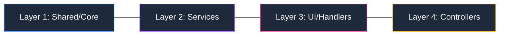

# CodeMarie: The Architectural Guardian


**CodeMarie** is an industrial-grade, model-agnostic agentic coding assistant designed to maintain architectural integrity in complex software ecosystems. Beyond simple code generation, CodeMarie acts as an **Architectural Guardian**, enforcing strict layering, managing distributed agentic workflows, and ensuring transactional stability across your workspace.

> [!IMPORTANT]
> **Oracle Grade Release (v3.82.0)**: This release introduces the **Oracle Grade Suggestion Engine**, a state-of-the-art diagnostic and architectural oracle. It leverages workspace-wide symbol resolution (Spider-Powered) and project-wide pattern enforcement to provide precision suggestions that preserve structural integrity.

---

## 🏗️ Core Pillars of Intelligence

### 🧬 Joy-Zoning Framework
CodeMarie enforces a rigorous architectural pattern known as **Joy-Zoning**. It automatically categorizes every file into one of five distinct layers and enforces "Outside-In" dependency rules. 

> [!TIP]
> Use the **Fluid Policy Engine** to monitor every file operation and prevent layer leaks in real-time.

### 🧠 Hyper-Cognition & Long-Term Memory
CodeMarie moves beyond simple context windows via a persistent **Knowledge Graph** (BroccoliDB):
*   **Semantic Compaction**: Automatically landmarks high-value architectural decisions to survive context prunings.
*   **Knowledge Graph (KG) Resilience**: Self-healing graph nodes that automatically repair broken semantic links during repo churn.
*   **Speculative Pipeline**: Preview multi-hop impact of intent grounded changes (`MEM_BLAST`) before execution.

### 🕷️ Spider Structural Intelligence Engine
CodeMarie v3.81.0 introduces the **Spider Engine**, representing a fundamental shift from static code analysis to **Structural Intelligence**:
*   **The Proposition**: To combat "Architectural Decay," Spider treats the codebase as a living **Dependency Web**. It identifies not just syntax errors, but the growth of **Structural Entropy**—disorder that accumulates as systems evolve.
*   **Incremental $O(C)$ Audits**: Unlike traditional liners that require a full scan, Spider uses a cas-hash based incremental model. This enables near-instantaneous audits on every commit, sensing "vibrations" and "tears" in the web's tension as they happen.
*   **The Four Pillar Model**:
    *   **Cognitive Depth**: Penalizing hierarchy nesting that exceeds human (and LLM) reasoning limits.
    *   **Semantic Consistency**: Enforcing predictable naming patterns to maintain a high-fidelity mental model.
    *   **Ecological Integrity**: Identifying and pruning "Dark Matter" (orphaned modules) that create hidden maintenance weight.
    *   **Modular Sovereignty**: Strictly enforcing layer boundaries to prevent "Circular Fragility."
*   **Blast Radius Intelligence**: Leverage the dependency graph to predict the multi-hop impact of a change before a single line is written.

### 🔮 Oracle Grade Suggestion Engine
CodeMarie v3.82.0 pioneers the **Oracle Grade Suggestion Engine**, transforming prompt suggestions into an architectural and diagnostic compass:
*   **Spider-Powered Symbol Resolution**: Automatically identifies and resolves the definitions of types causing workspace errors, providing the AI with the exact grounding needed for definitive fixes.
*   **Project-Wide Consistency**: Using `AgentContext`, the engine extracts and enforces your project's dominant idioms, error handling conventions, and naming styles.
*   **Parallelized Source Discovery**: Simultaneously gathers intelligence from Diagnostics, Git, BroccoliDB, Tree-Sitter, and the SpiderEngine with zero detectable latency regression.
*   **Intent-Based Suggestions (Oracle Modes)**:
    *   **Oracle Fix**: Precision resolution of active diagnostics.
    *   **Oracle Design**: Architectural improvements grounded in project-wide structural impact.
    *   **Oracle Learn**: Discovery-focused suggestions for explaining complex logic.

> [!TIP]
> For a deep dive into the philosophy and principles behind the engine, see [Spider Theory: Structural Entropy & Architectural Sovereignty](file:///Users/bozoegg/Downloads/cline-main/src/core/policy/SPIDER_THEORY.md).


### 🛡️ Transactional Stability & Speculation
*   **Ghost Branches**: Create ephemeral, Git-backed playgrounds for speculative refactors without polluting task history.
*   **Atomic Workspaces**: Complete restoration of any previous state via a git-backed checkpointing system.
*   **Foundational Resilience**: Deep cross-resource stabilization that ensures architectural integrity during high-entropy refactors.
*   **DB Shadowing**: Every workspace modification is staged in a transactional buffer before being committed.

---

## 🛠️ Industrial Infrastructure

### 🔗 Advanced MCP Hub
Full integration with the **Model Context Protocol (MCP)**:
- **SSE & Stdio Transports**: Multi-protocol support for local and remote tool servers.
- **Native OAuth**: Integrated authentication for enterprise-grade tool integrations.
- **Dynamic Env Expansion**: Intelligent environment variable resolution for sensitive configurations.

### 📊 OpenTelemetry Observability
High-fidelity telemetry for audit trails and performance tuning:
- **TTFT & Latency Tracking**: Real-time monitoring of Time to First Token.
- **Token Economics**: Precise cost tracking per task and turn.
- **Stability Metrics**: Monitoring "Architectural Entropy" and policy violation trends.

---

## 🚀 Model-Specific Optimization
CodeMarie provides custom-tuned **Prompt Variants** to extract maximum performance from frontier models:
- **Gemini 3.0 & GPT-5**: Native tool-calling optimizations and high-token window handling.
- **Trinity & Native Next-Gen**: Advanced reasoning prompts for complex system design.
- **Crossover/Search Models**: Specialized reasoning for web-assisted research.

---

## 📐 System Architecture

### 1. Core Architectural Layout
```mermaid
graph TD
    classDef primary fill:#1e293b,stroke:#3b82f6,stroke-width:2px,color:#fff;
    classDef secondary fill:#1e293b,stroke:#a855f7,stroke-width:2px,color:#fff;
    classDef database fill:#1e293b,stroke:#10b981,stroke-width:2px,color:#fff;
    classDef warning fill:#1e293b,stroke:#ef4444,stroke-width:2px,color:#fff;

    User((User Workspace)):::primary --> Extension[VS Code Gateway]:::primary
    Extension --> Controller[Core Controller / Main Event Loop]:::primary
    
### 1. Core Architectural Layout
```mermaid
graph TD
    classDef primary fill:#1e293b,stroke:#3b82f6,stroke-width:2px,color:#fff;
    classDef secondary fill:#1e293b,stroke:#a855f7,stroke-width:2px,color:#fff;
    classDef database fill:#1e293b,stroke:#10b981,stroke-width:2px,color:#fff;
    classDef warning fill:#1e293b,stroke:#ef4444,stroke-width:2px,color:#fff;

    User((User Workspace)):::primary --> Extension[VS Code Gateway]:::primary
    Extension --> Controller[Core Controller / Main Event Loop]:::primary
    
    subgraph "Knowledge Graph & Reasoning"
        Controller --> KGS[Knowledge Graph Service]:::primary
        KGS --> Predict[Blast-Radius Predictor]:::warning
    end

    subgraph "Fluid Policy & Enforcement"
        Controller --> JZ[Joy-Zoning Guard]:::warning
        JZ <--> Spider[Spider Structural Engine]:::warning
    end

    subgraph "Intelligent Suggestions"
        Controller --> SugS[Oracle Suggestion Service]:::secondary
        SugS <--> SugCache[(Lru Suggestion Cache)]:::database
    end
    
    subgraph "Transactional Persistence Layer"
        Controller --> DB[(BroccoliDB / SQLite)]:::database
        KGS --> DB
        JZ --> DB
        DB --> Shadows[Shadow Workspaces]:::database
        DB --> Nodes[Semantic Knowledge Nodes]:::database
    end
    
    Controller --> MCPHub["Model Context Protocol (MCP) Hub"]:::primary
    MCPHub -.-> ExtTools[External Dev Tools]
```


---

## 🗺️ Joy-Zoning Visual Map

CodeMarie maintains architectural purity by enforcing strict boundaries across five critical layers:



> [!NOTE]
> Dependency violations (e.g., L1 importing L4) are blocked by the **Universal Guard** with a `JOY_VIOLATION` signal.

---

## ⚡ Quick Start

1.  **Install**: Search for "CodeMarie" in the [VS Code Marketplace](https://marketplace.visualstudio.com/items?itemName=codemarie.codemarie).
2.  **Configure**: Add your API keys for [OpenRouter](https://openrouter.ai/), [Anthropic](https://www.anthropic.com/), [Google](https://ai.google.dev/), or [AWS Bedrock](https://aws.amazon.com/bedrock/).
3.  **Activate**: Click the CodeMarie icon in the sidebar and start your first "Architectural Intent" resolution task.

---

## 🤝 Contributing
Join us in building the world's most robust agentic assistant. Please read our [Contribution Guidelines](CONTRIBUTING.md) and [Security Policy](SECURITY.md).

---
## 🕰️ History & Origins
**CodeMarie** is a completely transformed, industrial-grade evolution of the original [Cline](https://github.com/cline/cline) repository. While it shares foundational DNA, the architecture, orchestration, and policy safeguarding have been reconstructed from the ground up to support enterprise-scale agentic coding.

---
*Built with ❤️ by the CodeMarie Team. Architectural Integrity is not an option; it's the core.*
