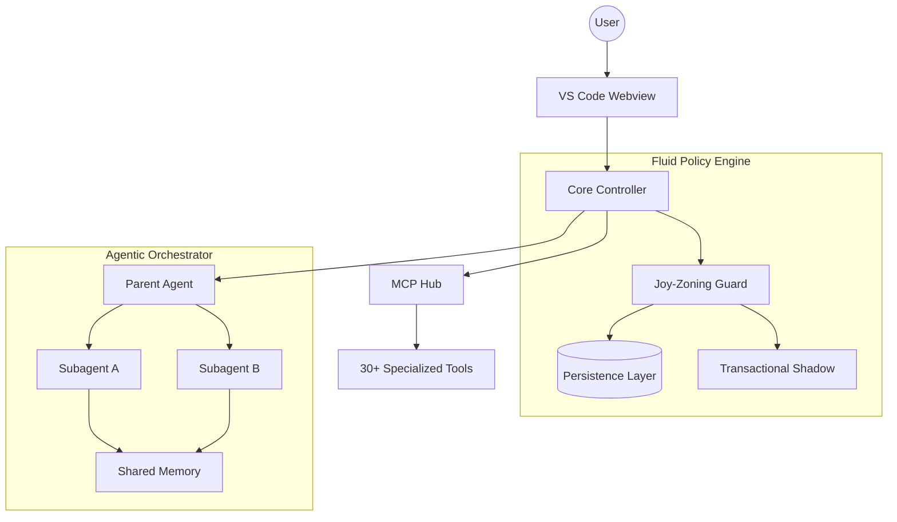

# CodeMarie: The Architectural Guardian

**CodeMarie** is an industrial-grade, model-agnostic agentic coding assistant designed to maintain architectural integrity in complex software ecosystems. Beyond simple code generation, CodeMarie acts as an **Architectural Guardian**, enforcing strict layering, managing distributed agentic workflows, and ensuring transactional stability across your workspace.

---

## 🏗️ Core Pillars of Intelligence

### 🧬 Joy-Zoning Framework
CodeMarie enforces a rigorous architectural pattern known as **Joy-Zoning**. It automatically categorizes every file into one of five distinct layers and enforces "Outside-In" dependency rules:

| Layer | Responsibility | Dependency Rule |
| :--- | :--- | :--- |
| **Domain** | Core business logic and entities. | No external dependencies. |
| **Core** | Orchestration and application services. | Depends only on Domain. |
| **Infrastructure** | Database, API clients, external services. | Depends on Core/Domain. |
| **UI** | Views, components, and presentation logic. | Depends on Core/Infrastructure. |
| **Plumbing** | Glue code, configuration, and entry points. | Can depend on any layer. |

> [!IMPORTANT]
> The **Fluid Policy Engine** monitors every file operation. If a change violates layer purity (e.g., an Infrastructure leak into the Domain), CodeMarie will proactively reject the change and suggest a refactor.

### 🧠 Distributed Agentic Intelligence
CodeMarie utilizes a hierarchical **Parent-Stream & Subagent** model to handle massive complexity:

*   **Subagent Orchestration**: Spawn specialized workers to research or implement sub-tasks in parallel.
*   **Shared Persistent Memory**: Subagents coordinate through a centralized memory layer, ensuring context consistency across distributed streams.
*   **Dynamic Skill Injection**: On-demand activation of specialized instruction sets ("Skills") that ground the agent in project-specific expertise.

### 🛡️ Transactional Stability & Persistence
*   **DB Shadowing**: Every workspace modification is staged in a transactional buffer (shadowing). Changes are only committed after a successful "Architectural Suitability" pass.
*   **SQLite Persistence**: All agentic state, focus chains, and policy health metrics are persisted in a local-first SQLite database.
*   **Atomic Workspaces**: Complete restoration of any previous workspace state via a git-backed checkpointing system.

---

## 🛠️ Industrial Infrastructure

### 🔗 Advanced MCP Hub
Full integration with the **Model Context Protocol (MCP)**:
- **SSE & Stdio Transports**: Multi-protocol support for local and remote tool servers.
- **Native OAuth**: Integrated authentication for enterprise-grade tool integrations.
- **Dynamic Env Expansion**: Intelligent environment variable resolution for sensitive configurations.

### 📊 OpenTelemetry Observability
High-fidelity telemetry for audit trails and performance tuning:
- **TTFT & Latency Tracking**: Real-time monitoring of Time to First Token.
- **Token Economics**: Precise cost tracking per task, turn, and subagent.
- **Stability Metrics**: Monitoring "Architectural Entropy" and policy violation trends.

---

## 🚀 Model-Specific Optimization
CodeMarie provides custom-tuned **Prompt Variants** to extract maximum performance from frontier models:
- **Gemini 3.0 & GPT-5**: Native tool-calling optimizations and high-token window handling.
- **Trinity & Native Next-Gen**: Advanced reasoning prompts for complex system design.
- **Crossover/Search Models**: Specialized grounding for web-assisted research.

---

## 📐 System Architecture

---

## ⚡ Quick Start

1.  **Install**: Search for "CodeMarie" in the [VS Code Marketplace](https://marketplace.visualstudio.com/items?itemName=codemarie.codemarie).
2.  **Configure**: Add your API keys for [OpenRouter](https://openrouter.ai/), [Anthropic](https://www.anthropic.com/), [Google](https://ai.google.dev/), or [AWS Bedrock](https://aws.amazon.com/bedrock/).
3.  **Activate**: Click the CodeMarie icon in the sidebar and start your first "Architectural Intent" grounded task.

---

## 🤝 Contributing
Join us in building the world's most robust agentic assistant. Please read our [Contribution Guidelines](CONTRIBUTING.md) and [Security Policy](SECURITY.md).

---
## 🕰️ History & Origins
**CodeMarie** is a completely transformed, industrial-grade evolution of the original [Cline](https://github.com/cline/cline) repository. While it shares foundational DNA, the architecture, orchestration, and policy safeguarding have been reconstructed from the ground up to support enterprise-scale agentic coding.

---
*Built with ❤️ by the CodeMarie Team. Architectural Integrity is not an option; it's the core.*
