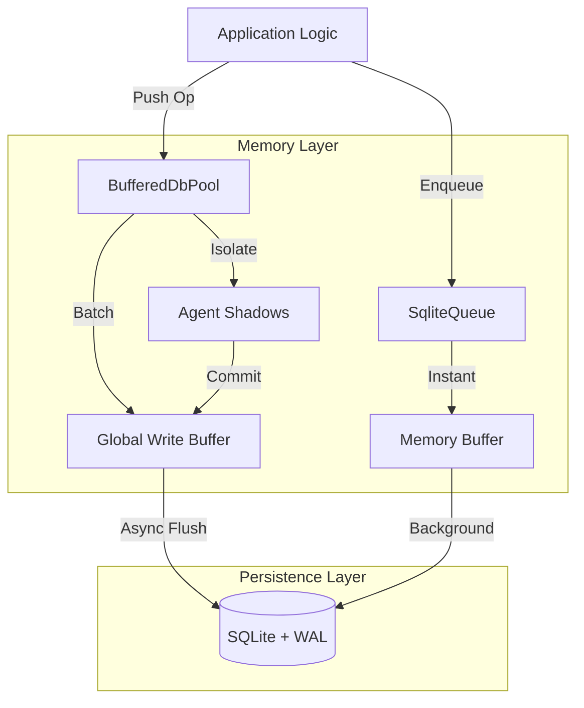

# 🥦 BroccoliDB: The Sovereign State Engine

```text
    __                                     ____  ____ 
   / /_  _________  ______________  ____  / / / / / / 
  / __ \/ ___/ __ \/ ___/ ___/ __ \/ __ \/ / / / / /  
 / /_/ / /  / /_/ / /__/ /__/ /_/ / /_/ / / /_/ / /   
/_.___/_/   \____/\___/\___/\____/\____/_/\____/_/    
                                                      
   PERSISTENCE SOVEREIGNTY | LEVEL 11 MASTERPIECE
```

**The High-Performance, Asynchronous, and Hardened SQLite Infrastructure for Node.js.**

Welcome to BroccoliDB — a production-grade infrastructure where **Memory is the Engine and SQLite is the Checkpoint.**

---

### 📑 Which Documentation Should I Read?

| If you are... | Read this... | Purpose |
| :--- | :--- | :--- |
| **New here** | 🚀 **[GET_STARTED.md](./GET_STARTED.md)** | **5-minute quick start guide** |
| **Building Agents**| 🤖 **[TUTORIAL_AI_AGENT.md](./TUTORIAL_AI_AGENT.md)** | Practical Guide for AI Loops |
| **Curious** | 🥦 **[MANIFESTO.md](./MANIFESTO.md)** | Instant concept capture (30-sec read) |
| **Strategic** | 🧠 **[STRATEGY.md](./STRATEGY.md)** | Understanding the Brain vs. Notebook |
| **Academic** | 🎓 **[WHITEPAPER.md](./WHITEPAPER.md)** | Formal technical analysis & citations |

---

### 🏎️ Sovereign Performance Tiers

| Tier | Best For | Max Ops/Sec | Volatility Risk |
| :--- | :--- | :--- | :--- |
| **Tier 1 (Cold Disk)** | Traditional CRUD / DB Backups | ~25k | 0% (Synch) |
| **Tier 2 (Batched/Buffer)**| Session Storage / Large Ingest | ~100k | ~500ms |
| **Tier 3 (Sovereign)** | **AI Reasoning / High-Freq Math** | **1M - 4.4M** | **~250ms** |

---

## 🚀 Quick Start

### 1. Install

```bash
npm install broccolidb
```

### 2. Initialize (CLI)

```bash
# Index your codebase and build the context graph
npx broccolidb init
```

### 3. Use in Code

```typescript
import { Connection, Workspace } from 'broccolidb';

const conn = new Connection({ dbPath: './broccolidb.db' });
const pool = conn.getPool();

// High-speed, memory-first push
await pool.push({
  type: 'insert',
  table: 'thoughts',
  values: { content: 'Thinking about the future...', timestamp: Date.now() }
});
```

---

## 🧠 The Sovereign Mind Strategy

BroccoliDB was built to solve the **Persistence Latency Bottleneck** that cripples modern AI agents. 

### The Brain vs. Notebook Analogy
Traditional database drivers require you to write down every thought in a notebook before you can have the next one. This creates massive latency for high-frequency reasoning. 

BroccoliDB separates these into two sovereign layers:
- **🧠 Layer 1: The Brain (RAM)**: You think at **4,400,000 thoughts per second**. This is real-time, in-memory cognition.
- **💾 Layer 2: The Notebook (SQLite)**: Every few hundred milliseconds (the Persistence Event Horizon), the Brain writes a **summary** of its conclusions to the notebook.

---

## 🏗️ Architecture Overview

BroccoliDB acts as the high-speed interface between your code and the persistence layer.



---

## 🛡️ Deep Technical Hardening

BroccoliDB automatically configures SQLite for maximum performance and stability:
- **Journal Mode: WAL**: Enables non-blocking concurrent readers and writers.
- **Synchronous: NORMAL**: The optimal balance for high-throughput applications.
- **Temp Store: MEMORY**: Keeps temporary processing off the disk.
- **MMap Size: 2GB**: Maps the database directly into memory for lightning-fast reads.
- **Thread Count: 4**: Optimized for multi-core Node.js environments.

---

## 📚 Further Documentation

- **[Detailed Usage (USAGE.md)](./USAGE.md)** - API reference and advanced patterns.
- **[Benchmarks (BENCHMARK.md)](./BENCHMARK.md)** - Verified performance findings and methodology.
- **[Knowledgebase (KNOWLEDGEBASE.md)](./KNOWLEDGEBASE.md)** - Internal schema and service reference.
- **[Architecture Deep Dive (ARCHITECTURAL_DEEP_DIVE.md)](./ARCHITECTURAL_DEEP_DIVE.md)** - Mathematical formulas for structural entropy and graph self-healing.

---

## 📜 License

Created with ❤️ by **MarieCoder**. Distributed under the **MIT License**. See `LICENSE` for details.
