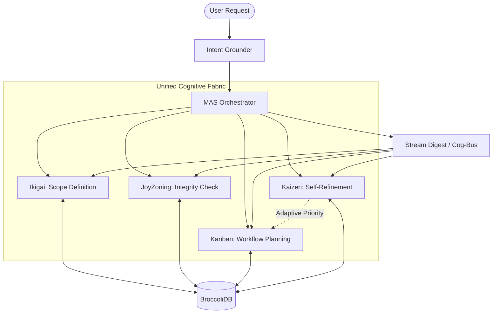

# MAS Technical Architecture

This document provides a deep dive into the technical implementation of the Multi-Agent System (MAS).

> [!TIP]
> This is a deep technical reference. For a high-level overview, see the [Multi-Agent System Overview](../multi-agent-system). For the full knowledge map, see the [Knowledge Base Guide](../KNOWLEDGE_BASE_GUIDE).

## System Topology

## Unified Cognitive Fabric Protocols

### 1. Shared Reasoning (Annotation)
Agents communicate through the graph using a native annotation protocol.
- **Method**: `annotateKnowledge(targetId, agentId, annotation)`
- **Mechanism**: Creates a node of type `thought` with an `ANNOTATES` edge to the target. It also builds a history within the target node's `metadata.annotations` for O(1) retrieval during search.

### 2. Adaptive Reprioritization
The system maintains high quality through dynamic task queue management.
- **Trigger**: `LogicalSoundness` evaluation in `KaizenSystem`.
- **Action**: Direct mutation of `AgentTask` records in BroccoliDB.
- **Effect**: Divergence or contradictions result in existing feature tasks being marked as `low` priority, forcing a focus on refinement tasks.

### 3. Predictive Handoff (The Cognitive Bus)
To prevent context drift, the `MultiAgentStreamSystem` generates a `StreamDigest` at the start of every pass.
- **Inclusion**: The digest is injected into the prompt of every sub-agent.
- **Context**: Includes total task counts, failures, architectural violations (Strikes), and average result entropy.

## Implementation Details

### Multi Agent Stream System
Located at `src/core/orchestration/MultiAgentStreamSystem.ts`.
This class implements the `MultiAgentTaskSystem` interface and coordinates the specialized sub-systems. It uses `Promise.all` for speculative execution where possible (e.g., fetching context while agents reason).

### Orchestration Controller
Located at `src/core/orchestration/OrchestrationController.ts`.
Manages the ephemeral memory (`AgentContext`) and provides a unified API for agents to interact with the underlying database and reasoning engines.
