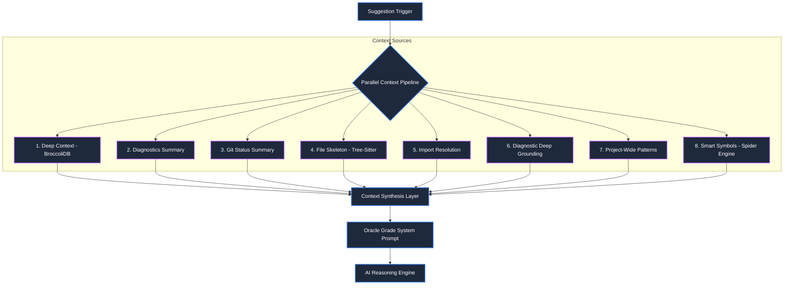
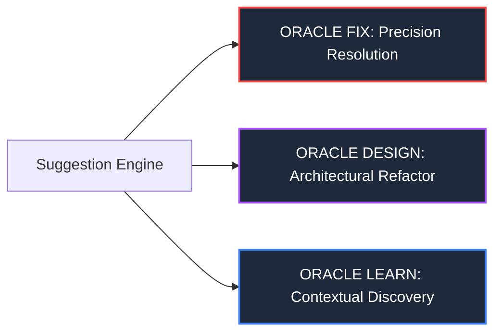

# Oracle Grade Suggestion Engine: Technical Knowledgebase

## 🔮 Overview
The **Oracle Grade Suggestion Engine** (`SuggestionService.ts`) is a high-precision, architecturally-aware system designed to provide hyper-grounded code suggestions. It moves beyond simple text-based completion by integrating deep workspace structural intelligence and real-time diagnostic resolution.

## 🏗️ Core Architecture

### 1. 8-Way Parallelized Context Pipeline
To minimize latency while maximizing grounding, the engine executes 8 distinct context gathering tasks in parallel:

- **Deep (BroccoliDB)**: Extracts structural impact and semantic importance.
- **Diagnostics**: Summarizes active workspace errors and warnings.
- **Git Status**: Identifies pending changes and architectural churn.
- **File Skeleton (Tree-Sitter)**: Generates a high-level AST-based map of the current file.
- **Import Context**: Resolves definitions for the top internal imports.
- **Diagnostic Grounding**: Resolves type definitions for symbols involved in active errors.
- **Project Patterns**: Extracts dominant design idioms and error-handling conventions.
- **Smart Symbols (Spider-Powered)**: Performs project-wide resolution for diagnostic-related symbols.

### 2. Semantic Importance Windowing
Instead of a static head-window, the engine uses **BroccoliDB** to identify and include the most semantically critical code blocks from anywhere in the file. This ensures the AI sees "the brain" of the module even if it's far from the header.

### 3. Oracle Modes (Cognitive Intent)
Suggestions are categorized into three explicit cognitive modes:

- **ORACLE FIX**: Resolving the most critical issues in `<diagnostics>`.
- **ORACLE DESIGN**: Architectural improvements grounded in project patterns.
- **ORACLE LEARN**: Explaining complex logic found in the code or resolved symbols.

## 🛡️ Architectural Guardrails
The engine enforces a strict set of guardrails to prevent architectural decay:
- **Modular Sovereignty**: Suggestions must not introduce circular dependencies.
- **Structural Integrity**: High-importance files (Importance > 7) are protected from invasive API changes.
- **Project Governance**: Suggestions are strictly grounded in `<project_patterns>` to ensure consistency with the existing codebase style.

## 📊 Performance & Resilience
- **Request ID Guarding**: Prevents late-arriving suggestions from overwriting current user intent.
- **Hardened Similarity Engine**: Uses the **Levenshtein Distance** algorithm (0.8 threshold) in `src/utils/string.ts` to ensure high-diversity user prompts.
- **LRU Caching**: Caches suggestions based on content hash and cursor position to minimize redundant AI calls.
- **Jittered Exponential Backoff**: Advanced retry logic for provider resilience, preventing "thundering herd" issues.
- **Latency Telemetry**: Tracks micro-latencies of each context component to identify micro-bottlenecks.
- **Proactive Context Warming**: Background indexing of SDS and structural data on file open to minimize first-suggestion latency.
- **Service-Level Memoization**: Caches Language Parsers and heavy structural resources to optimize parallel execution.

## 🛠️ Operator's Guide (Telemetry & Troubleshooting)

### Monitoring Health
The **Oracle Grade** Suggestion Engine outputs detailed telemetry for every successful generation. Check the **Internal Logs** for entries like:
`Generated suggestions in 1250ms. Component Latencies: {"deep":450,"diagnostics":150,"git":50,"skeleton":200,"imports":100,"diagGrounding":150,"projectPatterns":100,"smartSymbols":200}`

### Troubleshooting Latency
- If `total_latency` > 3s, identify the high-latency component (e.g., `deep`).
- If `deep` is slow, check BroccoliDB connection and pool state.
- If `smartSymbols` is slow, check the Spider Engine's cache and workspace size.

### Suggestion Quality
- If suggestions are generic, ensure the **AgentContext** is correctly pre-warmed.
- Ensure `<project_patterns>` are being extracted (requires design documentation or prominent coding idioms in the workspace).

## 🧭 ADR Reference
See [ADR 005: Oracle Grade Suggestion Engine](./ADR_005_ORACLE_SUGGESTION_ENGINE.md) for architectural rationale.

## 🛠️ Usage for AI Agents
When grounding a task involving the Suggestion Engine, always reference this knowledgebase. The system prompt in `SuggestionService.ts` is the definitive source for the "Oracle" spirit.

---
*Maintained by the CodeMarie Architectural Team.*
